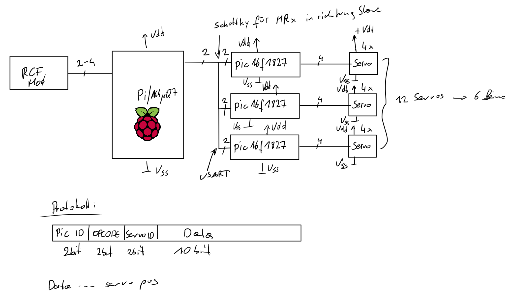

#cairo/servocon: motorcontroller firmware

##desc
This project contains the firmware for the motor-controller, which is installed on 3 PiCs (16F1827), with 3 different addresses. Each PiC handles 4 servos which can be set by sending 2 bytes per to the device via uart (rs-232). Since the uart is chained together (normally you don't do such a thing) the first byte must contain the address for the PiC. Additionally this byte also contains a mode and the servo address.

##controlling the servos
The PiC waits until it has received 2 bytes of information, where the first byte is denoted with the 7th set to 1. It then checks the encoded address in the package and takes action, if the address matches the own address, otherwise, the data is dropped.

<table>
  <tr>
    <td width="12.5%">bit</td>
    <td width="12.5%">7</td>
    <td width="12.5%">6</td>
    <td width="12.5%">5</td>
    <td width="12.5%">4</td>
    <td width="12.5%">3</td>
    <td width="12.5%">2</td>
    <td width="12.5%">1</td>
    <td width="12.5%">0</td>
  </tr>
  <tr>
    <td>byte 0</td>
    <td>1</td>
    <td colspan="2">PiC addr.</td>
    <td colspan="2">servo addr.</td>
    <td colspan="2">mode</td>
    <td>pos.msb</td>
  </tr>
  <tr>
    <td>byte 1</td>
    <td>0</td>
    <td colspan="6">pos</td>
    <td>pos.lsb</td>
  </tr>
</table>
